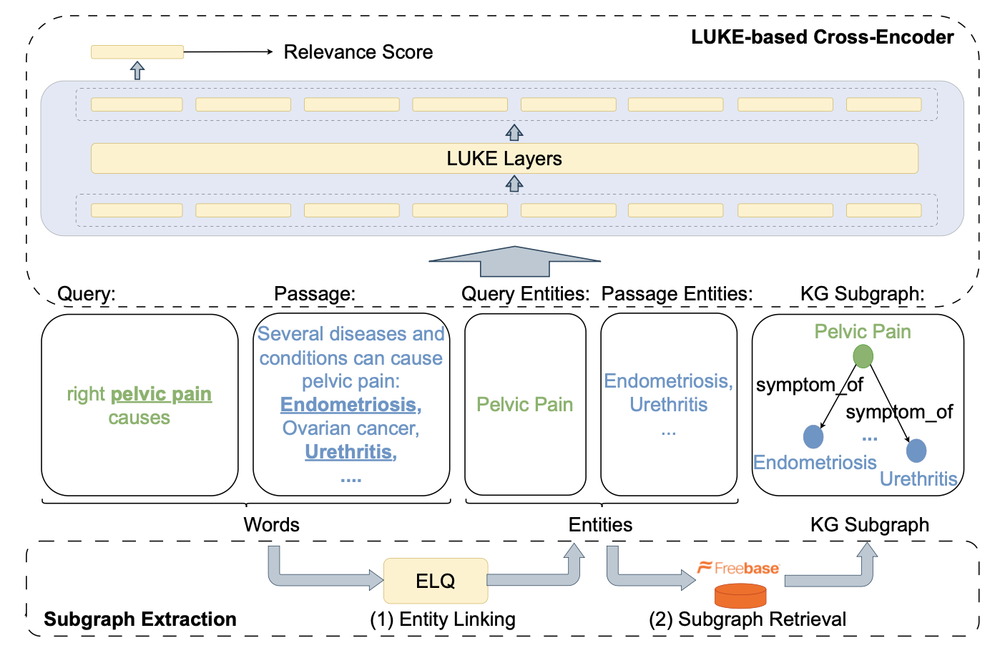

# KGPR: Knowledge Graph Enhanced Passage Ranking

This repository contains the implementation of our paper [KGPR: Knowledge Graph Enhanced Passage Ranking](https://dl.acm.org/doi/10.1145/3583780.3615252) (CIKM 2023 short).
<br>

# Introduction 

KGPR is a knowledge graph enhanced cross encoder model for the passage ranking task. It aims to leverage the information from a large knowledge graph (Freebase) to improve the passage ranking performance. Specifically, KGPR is built upon LUKE, an entity-aware pretrained language model, with an additional module that fuses information from knowledge graphs into LUKE to enhance the performance. Experimental results show that KGPR can outperform monoT5 cross-encoder by 3.32% and 10.77% on the MS MARCO Dev set and TREC DL-HARD query set respectively, using a model with a similar number of parameters.

 
<br>


# Requirements 
```
pyterrier 
pandas
scipy 
torch==1.13.1
transformers==4.26.1
``````
KGPR is implemented using the PyTerrier pipeline. The PyTerrier library can be installed following the instructions [here](https://github.com/terrier-org/pyterrier).
<br>

# Data 
The data for evaluating KGPR can be downloaded from [here](https://drive.google.com/drive/folders/1c6nyYhqi6EcxbUwEeIw54x_QGOtNR1Ds?usp=sharing). The folder contains the index, entity linking results, freebase data, and the checkpoint of our model, which are organised as follows: 

+ ```index```: contains the PyTerrier index of MS MARCO passage dataset, which is used in BM25. 

+ ```entity_linking_results```: contains the entity linking results of both queries and passages. 

  + ```query_dev_full_test_with_id.jsonl```: entity linking results of queries in the MS MARCO Dev set and all the test sets used in our paper. 
  + ```msmarco_passage_with_id.jsonl```: entity linking results of passages in the MS MARCO passage corpus. 
  + ```passage_test_with_id_bm25rank1000.jsonl```: a subset of entity_linking_msmarco_passage_with_id.jsonl, which includes entity linking results of passages in the BM25 results of all the test sets used in our paper. 

+ ```freebase```: the subgraph of Freebase used in our experiemnts. 

+ ```checkpoint```: model checkpoint of KGPR. 


# Evaluation 
In order to evaluate the performance of KGPR, you need to first download the data in previous section and then execute the code in ```kgpr.py``` to obtain the reranking performace. The ranking performance is obtained by first using BM25 to retrieve top-1000 relevant passages and then using KGPR to rerank these passages. 

For example, you can evaluate the performance of KGPR on the TREC DL-HARD dataset using the following command:

```
python kgpr.py \
    --index data/index \
    --query_entity_linking_file data/entity_linking_results/query_dev_full_test_with_id.jsonl \
    --passage_entity_linking_file data/entity_linking_results/passage_test_with_id_bm25rank1000.jsonl \
    --freebase data/freebase \
    --checkpoint data/checkpoint/kgpr.pt \
    --eval_dataset dl-hard 
```


---

**If you found the paper and the resources useful, please kindly cite our paper**:

```
@inproceedings{fang23kgpr,
  author = {Jinyuan Fang and Zaiqiao Meng and Craig Macdonald},
  title = {KGPR: Knowledge Graph Enhanced Passage Ranking},
  booktitle = {Proceedings of the 32nd ACM International Conference on Information and Knowledge Management},
  pages = {3880--3885},
  publisher = {ACM},
  year = {2023}
}
```

**Contact**:

If you have any questions, feel free to contact me via (fangjy6@gmail.com).


